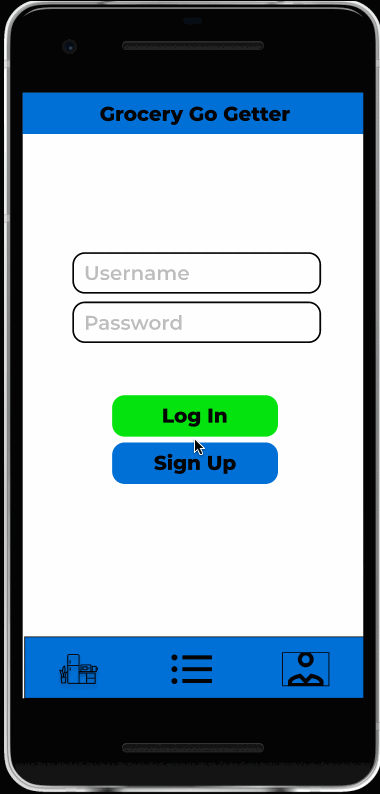

# Grocery Go Getter

## Table of Contents
1. [Overview](#Overview)
1. [Product Spec](#Product-Spec)
1. [Wireframes](#Wireframes)
2. [Schema](#Schema)

## Overview
### Description
Grocery Go Getter is a inventory tracking app that allows the user to keep an inventory of all food items in their pantry or refridgerator and also contains a shopping list to allow the user to properly map what items to get when they take a trip to the store!

### App Evaluation
[Evaluation of your app across the following attributes]
- **Category:**
- **Mobile:**
- **Story:**
- **Market:**
- **Habit:**
- **Scope:**

## Product Spec

### 1. User Stories (Required and Optional)

**Required Must-have Stories**

* User should be able to login using their username and password
* User should be able to create a new account if one does not exist
* User should be able to view a list of all of their items in their pantry
* User should be able to add items to their pantry
* User should be able to edit the order of the items
* User should be able to update item information (expiration date and amount)
* User should be able to delete an item
* User should be able to add to-do items in the shopping list
* Upon completing a task in the shopping list, the user should be able to select the task and a checkmark should appear to inform the user the task is completed.

**Optional Nice-to-have Stories**

* If an item is nearing its expiration date or the amount is getting low, the user should receive a system-wide notification regarding the low amount
* Color of the Amount element in the Pantry list should change colors depending on how much of the item is there
* If a user is adding an item, the icon of the item should be rendered by using an API that uploads the corresponding image of the product (i.e. if the user enters Chex Mix, the icon should be a Chex Mix bag)

### 2. Screen Archetypes

* Login/Register Screen - User signs up or logs into their account
   * User should be able to login using their username and password
    * User should be able to create a new account if one does not exist
    * User should stay logged in until logged out, persisting through the device

* Pantry Screen - view of items in a vertical order that contains name of product and amount
    * User should be able to view a list of all of their items in their pantry
    * User should be able to add items to their pantry
    * User should be able to edit the order of the items
    * User should be able to delete an item

* Item Detail Screen - detailed view of a specific product with additional information
    * User should be able to add/update item information (expiration date and amount)
    
* Shopping List Screen - to-do list for user
    * User should be able to add to-do items in the shopping list
    * Upon completing a task in the shopping list, the user should be able to select the task and a checkmark should appear to inform the user the task is completed.

### 3. Navigation

**Tab Navigation** (Tab to Screen)

* Pantry
* Shopping List

Optional:
* Account

**Flow Navigation** (Screen to Screen)

* Login/Register Screen
   * Account creation if no login is available
   * Navigates to User's Pantry page
* Pantry Screen
   * Selecting an item -> navigate to detailed view of item
   * Selecting shopping list tab -> navigate to shopping list screen
   * Selecting account page -> navigate to account page to show favorites and basic account info

## Wireframes


### Interactive Prototype


## Schema
Models

Product
| Property | Type | Description |
| -------- | ---- | ----------- |
| productName | String | Name of the product in inventory |
| itemIcon | String | File path of the product stored |
| amount | Number | The amount of that particular item |
| expirationDate| DateTime | Expiration date of the item |
| author | Pointer to User | Author of the product in inventory |

User
| Property | Type | Description |
| -------- | ---- | ----------- |
| username | String | Login for the user |
| password | String | Unique credential for the user (will be hashed)|

## Networking
List of network requests by screen
* User Login/Register Screen
  * (Create/POST) Register a user account
  ```Java
  ParseUser user = new ParseUser();
  user.setUsername("my name");
  user.setPassword("my pass");
  user.setEmail("email@example.com");

  // other fields can be set just like with ParseObject
  user.put("phone", "650-253-0000");

  user.signUpInBackground(new SignUpCallback() {
    public void done(ParseException e) {
      if (e == null) {
        // Hooray! Let them use the app now.
      } else {
        // Sign up didn't succeed. Look at the ParseException
        // to figure out what went wrong
      }
    }
  });
  ```
  * (Read/GET) Login to a user account
  ```Java
  ParseUser.logInInBackground("Jerry", "showmethemoney", new LogInCallback() {
  public void done(ParseUser user, ParseException e) {
    if (user != null) {
      // Hooray! The user is logged in.
    } else {
      // Signup failed. Look at the ParseException to see what happened.
    }
  }
  });
  ```
* Pantry Screen (shows existing items in the pantry)
  * (Read/GET) Retrieve a list of items in pantry for each user
  ```Java
  ParseQuery<ParseObject> query = ParseQuery.getQuery("items");
  query.whereEqualTo("author", "Pedro");
  query.findInBackground(new FindCallback<ParseObject>() {
      public void done(List<ParseObject> itemList, ParseException e) {
          if (e == null) {
              Log.d("item", "Retrieved " + itemList.size() + " items");
          } else {
              Log.d("item", "Error: " + e.getMessage());
          }
      }
  });
  ```
  * (Delete/DELETE) Delete an item from the pantry
  ```Java
   // After this, the playerName field will be empty
  myObject.remove("item");

  // Saves the field deletion to your Parse Server
  myObject.saveInBackground();
  ```
* Item Detail Screen
  * (Create/POST) Create a new item to the pantry
  ```Java
  ParseObject product = new ParseObject("product");
  product.put("itemName", "Milk");
  product.put("expirationDate", 2021-12-12);
  product.put("amount", 1);
  product.put("itemLogo", "file.png");
  product.put("author", some_user);
  product.saveInBackground();
  ```
  * (Update/PUT) Update an item's information like expiration date or amount
  ```Java
  product.put("amount", "0");
  product.put("expirationDate", 2020-12-12);
  product.saveInBackground();
  ```
* Pantry Screen (shows existing items in the pantry)
  * (Read/GET) Retrieve a list of to-do items
  ```Java
  ParseQuery<ParseObject> query = ParseQuery.getQuery("todo_items");
  query.whereEqualTo("author", "Pedro");
  query.findInBackground(new FindCallback<ParseObject>() {
      public void done(List<ParseObject> todoList, ParseException e) {
          if (e == null) {
              Log.d("todo", "Retrieved " + itemList.size() + " todo");
          } else {
              Log.d("todo", "Error: " + e.getMessage());
          }
      }
  });
  ```
  * (Delete/DELETE) Delete an to-do item
  ```Java
   // After this, the playerName field will be empty
  myObject.remove("item");

  // Saves the field deletion to your Parse Server
  myObject.saveInBackground();
  ```
  * (Create/POST) Create a to-do item
  ```Java
  ParseObject todo_item = new ParseObject("todo_item");
  product.put("description", "Buy Milk");
  product.saveInBackground();
  ```
  * (Update/PUT) Update a to-do item's name
   ```Java
  product.put("description", "Buy Apples");
  product.saveInBackground();
  ```
